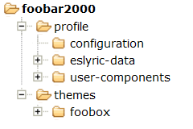
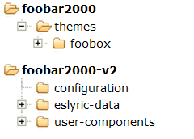

# foobox
foobox is a DUI (Default User Interface) theme for [foobar2000, x86 version](https://www.foobar2000.org). It is user-friendly, powerful and runs in high efficiency.
## [Develop]
The following third-party component are required:   
* [ESLyric](https://github.com/ESLyric/release) by ttsping;  
* [JSplitter](https://foobar2000.ru/forum/viewtopic.php?t=6378) based on [Spider Monkey Panel](https://github.com/TheQwertiest/foo_spider_monkey_panel);  
* [foo_enhanced_spectrum_analyzer](https://hydrogenaud.io/index.php/topic,116014.0.html).  

The following excellent codes are modified and used:  
* JS Smooth Playlist Manager，WSH Pplaylist View，JS Smooth Browser by br3tt;  
* WSH Cover Panel by Jensen;  
* Search box by Asion;  
* [Biography](https://github.com/Wil-B/Biography) by Wil-B;  
* Web Radio Lists collected from [Fanmingming](https://github.com/fanmingming) and [Kimentanm](https://github.com/Kimentanm).  
## [Installation]   
* From version 7.24, installer contains foobox and required components only. You should have foobar2000 installed with official release on [foobar2000.org](https://www.foobar2000.org)  
* From 7.26, foobox 6 Remastered revision is added for 32-bit application, with UI Hacks component integrated, it combines the features of 6 and 7.    
* Installation of extra video panel is optional. The video playback feature is provided by [foo-youtube](https://fy.3dyd.com/download/) and [foo_input_ffmpeg](https://www.foobar2000.org/components/view/foo_input_ffmpeg) components.   

<!--
Unpack the latest release package and then:
* Copy "themes" folder to your foobar2000 installation directory;
* Copy all folders of "profile" to foobar2000 profile directory;
* Biography panel(Wil-B) requires [fontawesome-webfont.ttf](https://ghproxy.com/https://github.com/beakerbrowser/beakerbrowser.com/raw/master/fonts/fontawesome-webfont.ttf), copy it to  C:\Windows\Fonts

> **Note** for portable installation, foobar2000 profile is located under root directory of foobar2000.
> Directory structure:

> **Note** for non-portable installation, foobar2000 profile is located in the user's data directory:\
> **C:\Users\YourUsername\AppData\Roaming\foobar2000** (version 1.x)\
> **C:\Users\YourUsername\AppData\Roaming\foobar2000-v2** (version 2.x)\
> Directory structure (2.x):

## [Extra panel of video]
From version 7.16, foobox supports foo-youtube and foo-mpv video panel integration, but they are not included in standard release pack. As needed, you may download the video panel integration packs([github](https://github.com/dream7180/foobox-en/releases/tag/video) | [gitee](https://gitee.com/dream7180/foobox-en/releases/tag/video)), install them as per instruction (similar with above), and then 
-->
* You may switch various foobox layouts from "Main Menu -- View -- Layout -- Quick setup".

## [Preview]

