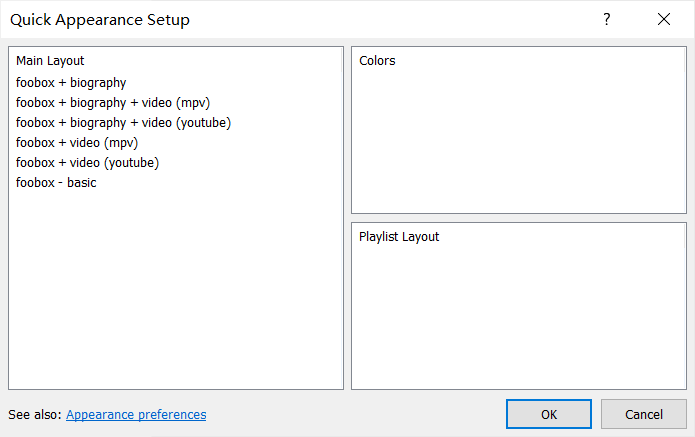
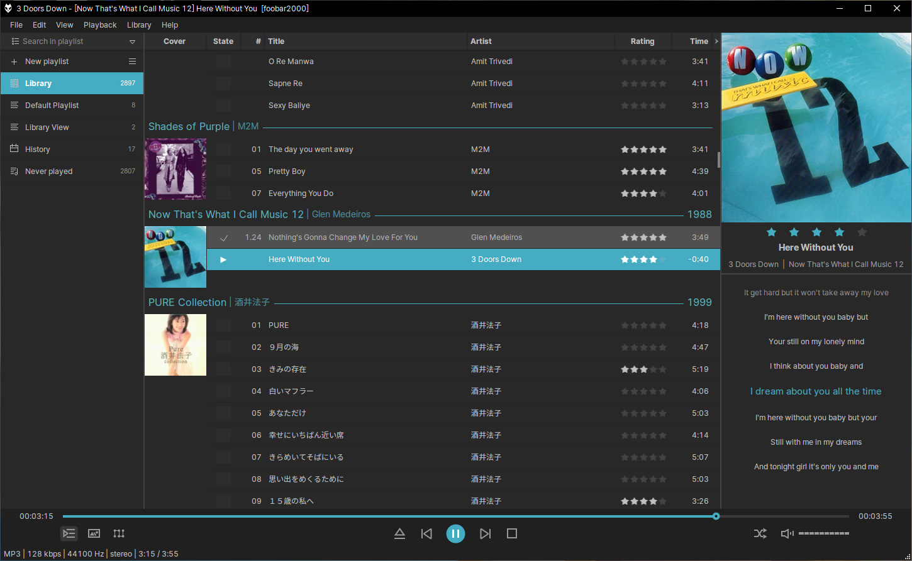
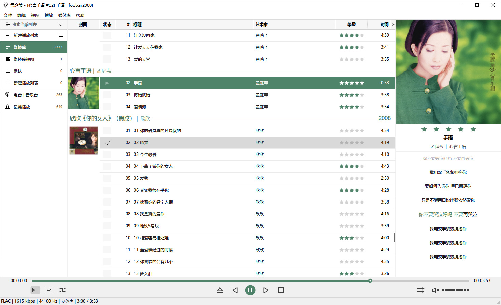

# foobox
foobox is a DUI (Default User Interface) theme for [foobar2000, x86 version](https://www.foobar2000.org). It is user-friendly, powerful and runs in high efficiency.
## [Develop]
The following third-party component are required:   
* [JSplitter](https://foobar2000.ru/forum/viewtopic.php?t=6378) based on [Spider Monkey Panel](https://github.com/TheQwertiest/foo_spider_monkey_panel);  
* [ESLyric](https://github.com/ESLyric/release) by ttsping;  
* [foo_enhanced_spectrum_analyzer](https://hydrogenaud.io/index.php/topic,116014.0.html).  

The following excellent codes are modified and used:  
* JS Smooth Playlist Manager，WSH Pplaylist View，JS Smooth Browser by br3tt;  
* WSH Cover Panel by Jensen;  
* Search box by Asion;  
* [Biography](https://github.com/Wil-B/Biography) by Wil-B;  
* Web Radio Lists collected from [Fanmingming](https://github.com/fanmingming) and [Kimentanm](https://github.com/Kimentanm).  
## [Installation]   
* From version 7.24, installer contains foobox and required components only. You should have foobar2000 installed with official release on [foobar2000.org](https://www.foobar2000.org)  
* From 7.26, foobox 6 Remastered revision is added for 32-bit application, with UI Hacks component integrated, it combines the features of 6 and 7.   
* From 7.42, Windows 7 is not supported due to update of JSPlitter, 7.4.2 release supporting win7 by using old JSPlitter can be downloaded from [github](https://github.com/dream7180/foobox-en/releases/tag/7.42) or [gitee](https://gitee.com/dream7180/foobox-en/releases/tag/7.42)
* Extra video panel is optional (play video with fb2k is not recommended). foobox-video could be downloaded from [github](https://github.com/dream7180/foobox-en/releases/tag/video76) or [gitee](https://gitee.com/dream7180/foobox-en/releases/tag/video76).  
* The video playback feature is provided by [foo-youtube](https://fy.3dyd.com/download/), [foo_input_ffmpeg](https://www.foobar2000.org/components/view/foo_input_ffmpeg) and [foo-mpv](https://github.com/sammoth/foo_mpv) & its [x64](https://github.com/intrigit/foo_mpv) components.     

* You may switch various foobox layouts from "Main Menu -- View -- Layout -- Quick setup".

## [Preview]

