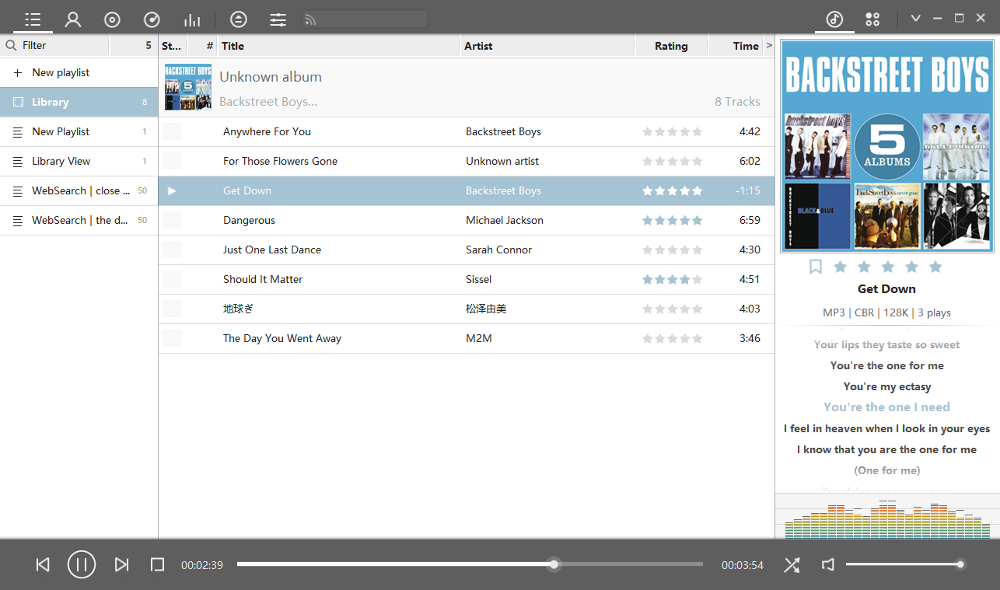

#ExifPro Mod

foobox is an CUI integration for foobar2000. Providing friendly and modern UI and extensive configuration for foobar2000. 
Able to adapt to high resolution display (please refer to foobox-help.chm), be good at library management, support multi-types of covers, providing some functions on internet searching and download (music, cover and lyric). 

