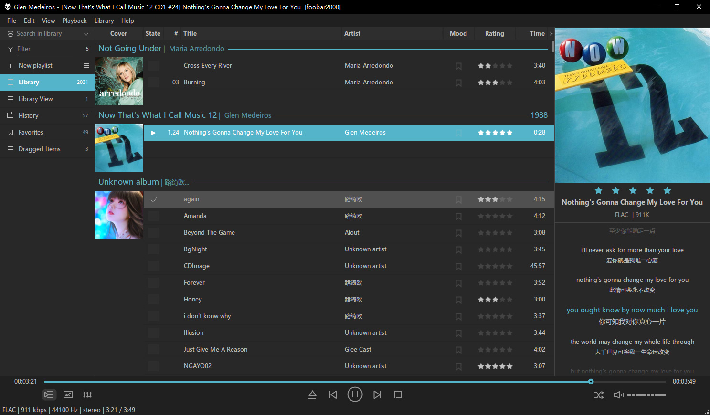

# foobox

foobox is a DUI (Default User Interface) layout for foobar2000, providing friendly & modern UI and extensive capability for library management, artwork support etc.    
-----------------------------------\
##[Installation]\
For the time being, foobar2000 x64 is not supported due to the component JSplitter (32 bit only).\
Unpack the latest release package and then:\
--> Copy "themes" folder to your foobar2000 installation directory;\
--> Copy "profile" folder to foobar2000 profile directory (for non-portable installation, profile is located in the user's data directory:  C:\Users\YourUsername\AppData\Roaming\foobar2000). 

