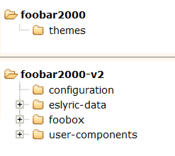

# foobox
foobox is a DUI (Default User Interface) layout for foobar2000, providing friendly & modern UI and extensive capability for library management, artwork support etc.
## [Installation]
> **Note** So far foobar2000 x64 is not supported due to the component JSplitter having x86 version only.

Unpack the latest release package and then:
* Copy "themes" folder to your foobar2000 installation directory;
* Copy all folders of "profile" to foobar2000 profile directory;
* Biography panel(Wil-B) requires [fontawesome-webfont.ttf](https://ghproxy.com/https://github.com/beakerbrowser/beakerbrowser.com/raw/master/fonts/fontawesome-webfont.ttf), copy it to  C:\Windows\Fonts

> **Note** for portable installation, foobar2000 profile is located under root directory of foobar2000.
> Directory structure:

> **Note** for non-portable installation, foobar2000 profile is located in the user's data directory:\
> **C:\Users\YourUsername\AppData\Roaming\foobar2000** (version 1.x)\
> **C:\Users\YourUsername\AppData\Roaming\foobar2000-v2** (version 2.x)\
> Directory structure (2.x):

## [Extra panel of video]
From version 7.16, foobox supports foo-youtube and foo-mpv video panel integration, but they are not included in standard release pack. As needed, you may download the video panel integration packs([github](https://github.com/dream7180/foobox-en/releases/tag/video) | [gitee](https://gitee.com/dream7180/foobox-en/releases/tag/video)), install them as per instruction (similar with above), and then you may switch various foobox layouts from "Main Menu -- View -- Layout -- Quick setup".\

## [Preview]

